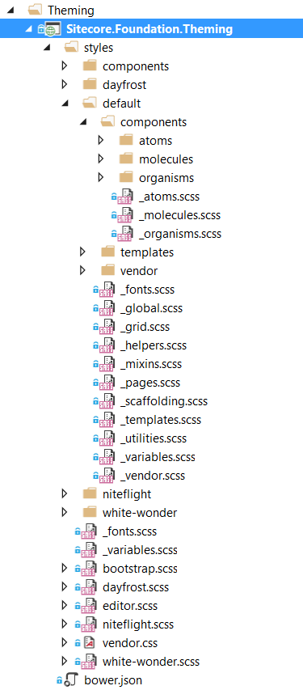
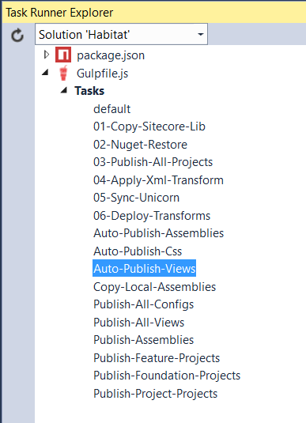
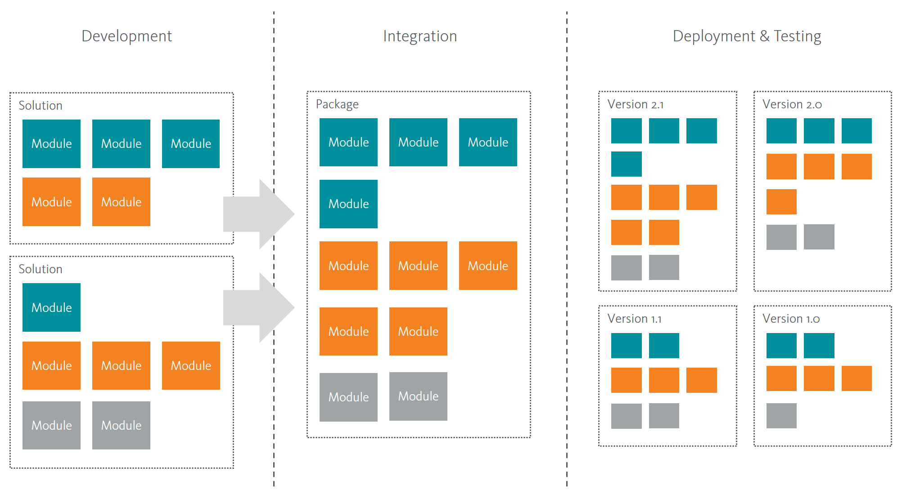
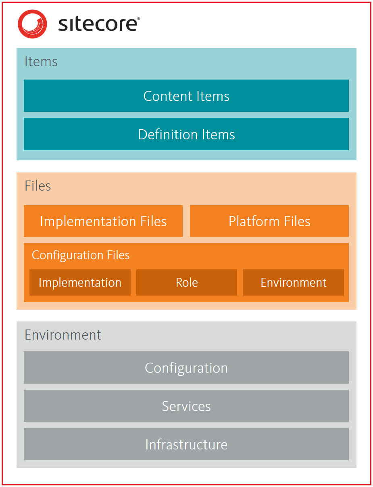

.. [2]
   http://www.amazon.com/Software-Development-Principles-Patterns-Practices/dp/0135974445

.. [3]
   

.. [4]
   

.. [5]
   “If it walks like a duck and it quacks like a duck, then it is a
   duck”. https://en.wikipedia.org/wiki/Duck_typing

.. |image0| image:: media/image3.png
   :width: 6.26806in
   :height: 2.25139in
.. |image1| image:: media/image4.png
   :width: 3.78828in
   :height: 2.30671in
.. |image2| image:: media/image5.png
   :width: 4.63380in
   :height: 1.87026in
.. |image3| image:: media/image6.png
   :width: 3.78740in
   :height: 2.04770in
.. |image4| image:: media/image7.png
   :width: 3.78740in
   :height: 1.53493in
.. |image5| image:: media/image8.png
   :width: 1.57480in
   :height: 1.18110in
.. |image6| image:: media/image9.png
   :width: 3.25913in
   :height: 1.18110in
.. |image7| image:: media/image10.png
   :width: 1.18110in
   :height: 1.92445in
.. |image8| image:: media/image11.png
   :width: 1.18110in
   :height: 2.39052in
.. |image9| image:: media/image12.png
   :width: 3.83753in
   :height: 6.26056in
.. |image10| image:: media/image13.png
   :width: 2.90278in
   :height: 5.55573in
.. |image11| image:: media/image14.png
   :width: 2.70833in
   :height: 3.32264in
.. |image12| image:: media/image15.png
   :width: 2.86756in
   :height: 2.01389in
.. |image13| image:: media/image16.png
   :width: 2.99306in
   :height: 4.47434in
.. |image14| image:: media/image17.png
   :width: 1.38077in
   :height: 2.12676in
.. |image15| image:: media/image18.png
   :width: 2.36687in
   :height: 3.52531in
.. |image16| image:: media/image19.png
   :width: 2.49188in
   :height: 3.50030in
.. |image17| image:: media/image20.png
   :width: 3.82686in
   :height: 3.43662in
.. |image18| image:: media/image21.png
   :width: 2.47183in
   :height: 3.07179in
.. |image19| image:: media/image22.png
   :width: 2.09919in
   :height: 6.23967in
.. |image20| image:: media/image23.png
   :width: 5.75000in
   :height: 3.96499in
.. |image21| image:: media/image24.png
   :width: 2.10852in
   :height: 3.95868in
.. |image22| image:: media/image25.png
   :width: 2.41688in
   :height: 4.39205in
.. |image23| image:: media/image26.png
   :width: 2.53355in
   :height: 4.82542in
.. |image24| image:: media/image27.png
   :width: 2.57522in
   :height: 3.52531in
.. |image25| image:: media/image28.png
   :width: 1.85485in
   :height: 4.28169in
.. |image26| image:: media/image29.png
   :width: 1.85649in
   :height: 3.66631in
.. |image27| image:: media/image30.png
   :width: 4.63735in
   :height: 6.19718in
.. |image28| image:: media/image31.png
   :width: 2.30853in
   :height: 3.22528in
.. |image29| image:: media/image32.png
   :width: 6.26806in
   :height: 3.97361in
.. |image30| image:: media/image33.png
   :width: 3.88367in
   :height: 2.23353in
.. |image31| image:: media/image34.png
   :width: 5.56715in
   :height: 3.55864in
.. |image32| image:: media/image35.png
   :width: 6.26806in
   :height: 4.94306in
.. |image33| image:: media/image36.png
   :width: 5.51408in
   :height: 1.54194in
.. |image34| image:: media/image37.png
   :width: 6.26806in
   :height: 1.62083in

.. |image37| image:: media/image40.png
   :width: 4.30282in
   :height: 3.42185in

.. |image39| image:: media/image42.png
   :width: 6.26806in
   :height: 1.52292in

.. |image42| image:: media/image45.png
   :width: 3.27465in
   :height: 1.46199in
.. |image43| image:: media/image46.png
   :width: 2.38028in
   :height: 1.06767in
.. |image44| image:: media/image47.png
   :width: 4.81690in
   :height: 3.26232in

