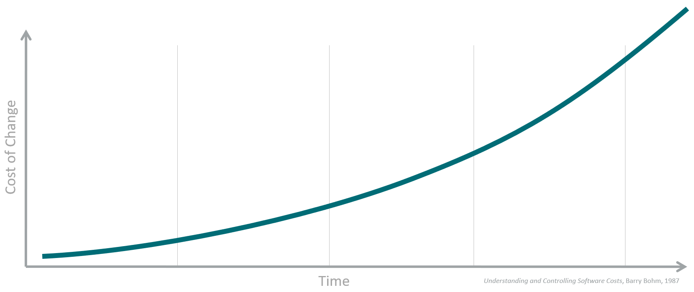
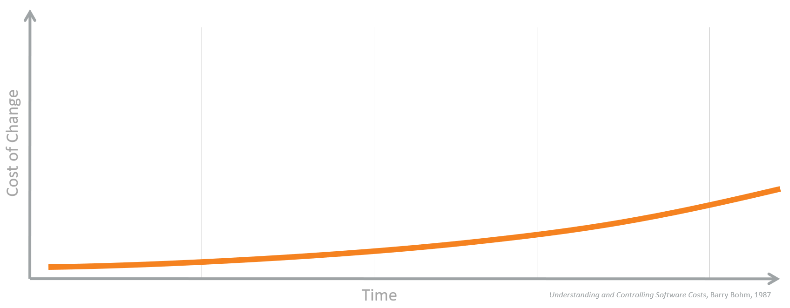

Why Sitecore Helix?
--------------------------

The Sitecore Experience Platform lends itself to customer implementations with
complex requirements through its robust data model, extensibility, and
integration abilities. Solutions can span multiple servers/services including
the core Content/Experience Management, XConnect, and Experience Commerce.

The amount of technical debt in these large, complex solutions will grow over
time, and if not managed well, the cost and effort associated with adapting
the solution to changing requirements will increase to a point where the cost
of change is higher than the value the change provides to the business.

    Figure: Cost of Change over Time

The reason for this increasing cost is the tendency for solutions
to develop :doc:`uncontrolled dependencies with high coupling </principles/architecture-principles/dependencies>`
between features in a code base, when necessary changes/refactoring are
not made to properly implement requirements (a.k.a. technical debt).

These challenges are not unique to Sitecore. There are some well-established
*principles of software design* that should be used when designing any software project.
One of the key principles is to be very explicit about the dependencies between
software modules. This makes the modules easier to code, test and maintain.
The principles apply to any software project in any language, so they are equally
applicable to Java as they are to .NET and Sitecore.

*Sitecore Helix* is an application of those principles into **recommended practices**
and **conventions** for the Sitecore developers. They are practices which are optimized for
the typical needs of a Sitecore implementation, which applied well will result
in a modular architecture, with controlled dependencies, giving you more
maintainable code and lowering the cost of change for your customer.

    Figure: Lower Cost of Change over Time

.. note::

    **Principles of Package and Component Design**

    Some of the core solution architecture principles which guide Sitecore Helix are described
    in Chapter 28 of `Agile Principles, Patterns, and Practices in C# by Robert C. Martin <https://www.amazon.com/gp/product/B0051TM4GI>`__.

    :doc:`The Architecture Principles Section </principles/architecture-principles/index>` of this document
    describes Sitecore Helix's application of these, and
    :doc:`The Package Principles Appendix </appendix/package-principles>` provides a plain-language overview of the principles and how they
    relate to Sitecore Helix practices.
