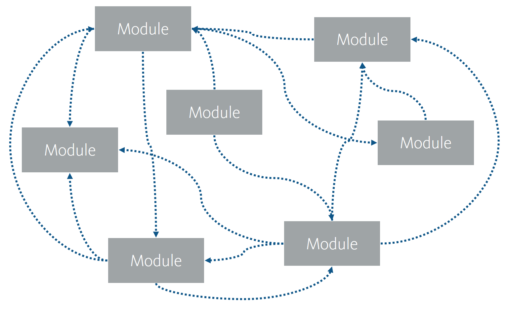
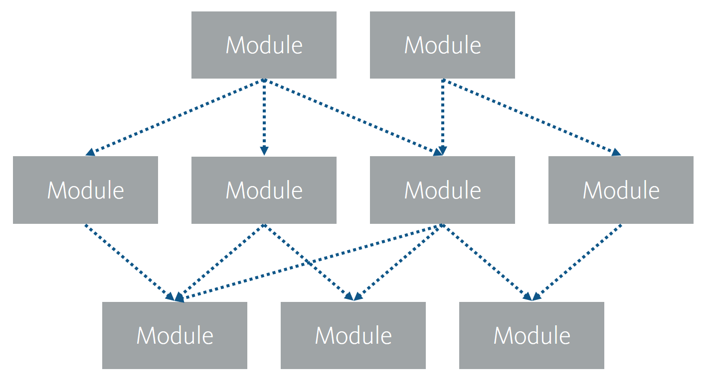

Dependencies
~~~~~~~~~~~~

Controlling dependencies throughout a solution is critical to software
development in any shape or form. This is both important in the micro
architecture – how you break down functionality into methods, classes,
class inheritance etc. – but equally so in macro architecture – how you
define the overall features of the solution and how these features are
coupled.

One of the fundamental principles of object-oriented programming is High
Cohesion and Low Coupling. High cohesion relies on breaking the solution
down into the right parts with logic that belong together – in Helix
referred to as modules – and low coupling relies on keeping the number
of dependencies between the different parts down to the absolute
minimum.

    Figure: Uncontrolled Dependencies, High Coupling

A solution where dependencies are not controlled and with high coupling
between the various parts (maybe even to a degree where there are no
tangible parts of the solution) very quickly becomes unmanageable and
general stability is affected because changes cannot be made without
affecting many parts of the solution. This decrease in productivity
resulting from the lack of architectural focus is often referred to as
technical debt.

With an increase in functionality, the interconnection between modules
becomes so high that productivity slowly grinds to a halt. The effort is
spent on maintaining the relationships between features, testing and
stabilising the solution as opposed to developing new functionality.

.. figure:: _static/image5.png

    Figure: Effort wasted on High Coupling

If a more structured approach to coupling is taken, as described in
Helix, the number of dependencies between features is reduced
dramatically. And by reducing the number of dependencies and also making
them apparent and obvious, the developers will know exactly what effects
any change will have on the wider solution, greatly reducing the effort
spent on stability and testing. Also, by isolating features, with
defined interfaces and clear dependencies, the internal workings of the
individual modules become less of an impediment, as developers can focus
exclusively on the business feature they are addressing, thus greatly
increasing flexibility of the solution and productivity of the team.

    Figure: Controlled Dependencies, Low Coupling

Types of dependencies
^^^^^^^^^^^^^^^^^^^^^

In software, dependencies can either be explicit or implicit. Examples
of explicit dependencies are the keyword :code:`using` in C#, and a reference in
one assembly to another. Examples of implicit dependencies are a class
string in the HTML mark-up, references to Sitecore fields by name or
reliance on specific technology behaviours in one module without
explicitly referencing the module or exposing this behaviour in the
interface of the module.

It is very important to stress that conceptually, as well as
practically, all dependencies between modules count. In a Sitecore
context this includes not only references between C# classes and .NET
assemblies, but also references from code to Sitecore templates and
fields, references between templates, references from templates to
renderings, references from HTML mark-up to CSS, calls from the Website
through to other subsystems like the Commerce Engine, and so on. Therefore,
when working in a modular architecture environment with Sitecore, make
sure you constantly keep an eye out for loose coupling or implicit
dependencies, and actively ensure dependencies are as explicit as
possible.
