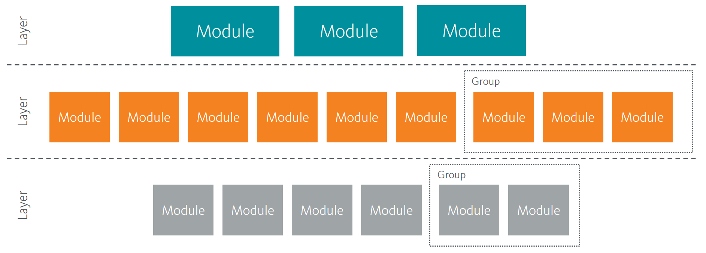

Architecture Principles
-----------------------

The architecture principles and conventions defined in Helix focus
largely on macro architecture, i.e. how the complete solution is put
together for maximum productivity, quality and longevity. This is not to
say that lower level architecture and principles – class design, code
structure, naming conventions etc. – are not important, but these
principles are often more focused on general developer practices and
less related to Sitecore.

There are three main topics important to Helix and modular architecture:

Dependencies
    which describe how feature and functionality in the solution relate to each other.

Layers
    which control the direction of dependencies and thereby assure a manageable solution.

Modules
    which define the isolation of features and functionality leading to greater discoverability and simplicity in the development process.

    Figure: Logical architecture of Helix

.. toctree::
    :caption: Topics 
    :titlesonly:

    dependencies
    layers
    modules
    domain-language