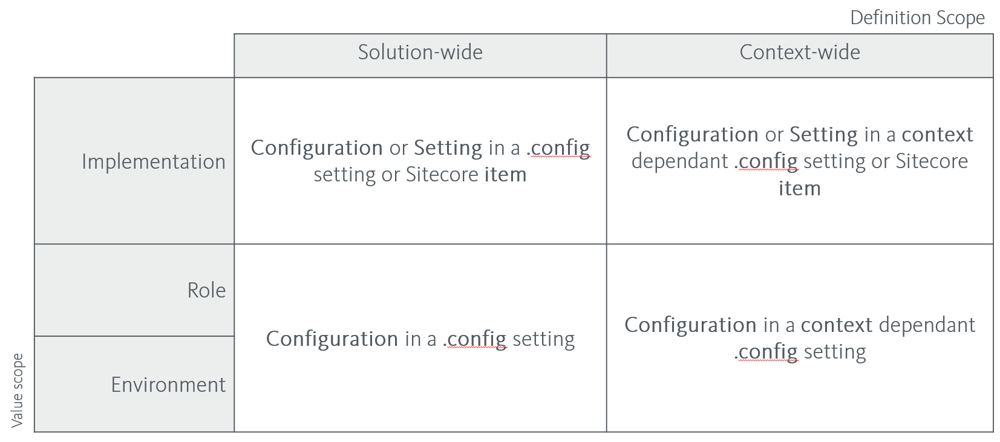

Configuration strategy
~~~~~~~~~~~~~~~~~~~~~~

It is very important to have a strategy for configuration and settings
management, as wrong or missing configuration can not only have a
negative impact on for example the performance and stability of the
running solution, but poor configuration management can also slow down
the productivity of the development team, as aspects such as deployment
and upgrades can be unnecessarily complicated.

We differentiate *Configuration* from *Settings* in that *Settings* are
aimed at the user roles (editor, administrator) and *Configuration* is
aimed at the developer or IT system administrator roles.

This differentiation makes it significant where and how Settings and
Configurations are managed in the Application Lifecycle. For example,
you should be cautious of having Configurations defined as Sitecore
content, as this can make it harder for developers and IT administrators
to manage during deployment and upgrades, and can make it difficult to
manage environment or server specific values such as connection strings.
Take particular notice of the scopes of the configuration as defined in
the following.

Each Configuration or Setting – whether predefined by for example
Sitecore or defined by a module in your implementation - will have a
*Definition Scope* and a *Value Scope*:

Definition Scope
    describes on which level the configuration is
    defined, i.e. in what scope of effect a change of value will have.

Value Scope
    defines in which circumstance values changes.

The following table describes the possible combinations of scope, and
how configurations and settings map to those.

    Figure: Scope of Configuration and Settings

Avoid having *Settings* defined in .config files as this counters the
purpose of Sitecore users being able to change them. Please note that –
although confusing – the <settings> section in the Sitecore .config
files is considered *Configuration*.