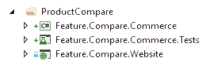

Sitecore Experience Commerce
~~~~~~~~~~~~~~~~~~~~~~~~~~~~

When working with Sitecore Experience Commerce, there are several
more subsystems that you could end up posting code or config changes
to. These include:

- Sitecore Commerce Engine roles (Shops, Authoring, Ops, Minions)
- Sitecore Commerce Business Tools
- Identity Server

This does add complexity to your solution & deployment - both locally
and to your Production & Non-Production environments. The key thing is
to remember that this added complexity shouldn't stop you from following
all of the Helix guidelines discussed in this document. The Common Closure 
Principal states that Classes that change together are packaged together,
and that still applies to your Commerce functionality. 

The commerce functionality will be split up between the Modules you have 
throughout your Foundation, Feature & Project layers.

Module Structure
^^^^^^^^^^^^^^^^
Not all of your modules will contain functionality that runs on both the
Website & in the Commerce Engine, but it is very common. For example a Product
Compare module that stores the list of products in the Engine, and displays this
list to the end user on the Website. In this scenario the functionality will
be split between the Engine & the Website - however as these two elements are very
coherent the Common Closure Principal states that should live together. 

You can see that the example Feature module above contains a series of projects, each
with its own responsibility. One houses the code that runs in the Commerce Engine, one handles 
the Unit Tests and the final one houses the code that runs in the website. Crucially however 
all of this code exists together in same module.

Note also that a suffix on the project name is used to show the subsystem that is
being targeted by that project.

Commerce Engine
^^^^^^^^^^^^^^^^^^^^^
The Commerce Engine is the .NET Core application that provides the commerce functionality
to a Sitecore Experience Commerce installation. This functionality is made up of
both Feature & Foundation modules. The .NET Core application then references all of these
modules to pull all of this together and form the final deployable asset for the Engine roles. 
As the .NET Core application pulls its functionality from the Feature & Foundation layers 
it must exist in Project layer.

.. figure:: _static/CommerceEngine.png

This ensures that the dependencies flow in the correct direction.